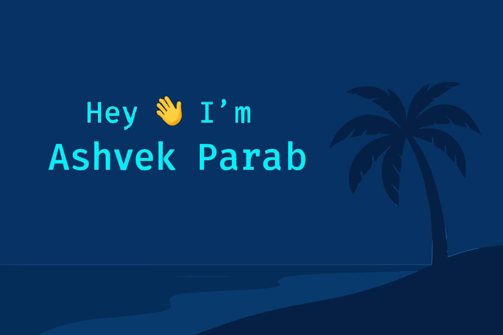

<!-- 🔥 Futuristic Banner + Animated Intro -->

  

  

---

## 💫 About Me
- 🎓 I’m a **Computer Engineering Student** at [AITD, Goa](https://aitdgoa.edu.in/)
- 💻 Passionate about **Web Development**, **AI**, and **Backend Systems**
- 🧠 Skilled in **C**, **C++**, **Python**, **HTML**, **CSS**, **JavaScript**, and learning **Django**
- 🌱 Currently building cool projects for **[Sheshank Transport](mailto:gaureshshett@gmail.com)**
- 🎯 Goal: *Become one of the richest and smartest tech minds in India 💸*
- ⚡ Motto: *"Keep evolving. Keep shipping. Keep dreaming."*

---

## 🧠 Skills & Tools

  

---

## 🚀 Featured Projects
> 🎨 Hover & click on project titles — they link to your real repos!

<table align="center">
  <tr>
    <td align="center" width="50%">
      
    </td>
    <td align="center" width="50%">
      
    </td>
  </tr>
  <tr>
    <td align="center" width="50%">
      
    </td>
    <td align="center" width="50%">
      
    </td>
  </tr>
</table>

  💡 Want to see more? Check out 👉 <a href="https://github.com/ashvekparab?tab=repositories">All My Projects</a>

---

## ⚡ GitHub Stats & Activity

  
  

  

---

## 🏆 GitHub Trophies

  

---

## 🌐 Connect With Me

  
  
  

---

## 💡 Quote That Drives Me
> “Code. Create. Conquer. Every line brings me closer to my dream.”  
> — *Ashvek Parab*

---

## 🐍 Contribution Snake Animation
### 🐍 Contribution Snake

  

---

## 🪩 Dynamic Animations

  

  

---

  

---

✨ Crafted with passion by <b>Ashvek Parab</b> 💻 | Powered by Creativity & Coffee ☕

